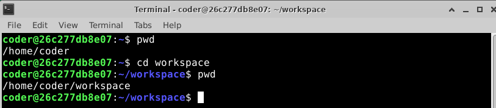
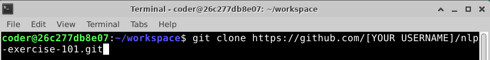
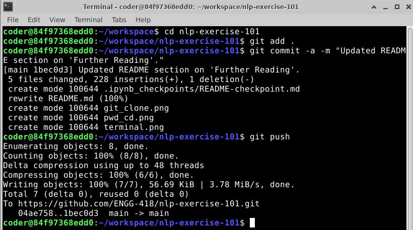

## Basic Git for this Course
Git is a powerful tool for collaboration and version control that we will use extensively in this program. The instructions below detail the simplest way to copy an assignment from a course template and maintain your own repository for that assignment. There is a lot more that you can do with Git that goes beyond this brief tutorial, and we encourage you to read the Git documentation as needed in this program (particularly when collaborating on course projects). 

### Forking a Repository (an Assignment)
When you "fork" a repository from the Course Organization GitHub, you are making a copy of that project in your personal GitHub. In this program, we will tag repositories by the class, the type of assignment, and the week/sprint of that assignment, and what item it is within that time frame. This will help your personal GitHub repos stay organized both temporally and by course.

### Cloning a Remote Repository to the Local Environment
To work on an assignment, open up a terminal window by clicking on "terminal" on the desktop:

This window will open up to `/home/coder`, which is your central directory and can be referenced by `~`. You can check your present working directory with the `pwd` command. We can use a "change directory" command to switch to `/home/coder/workspace` by typing `cd workspace` in the directory `/home/coder`. 

> [!CAUTION]
> `/home/coder/workspace` (and subsequent directories stemming from this location) are the **only** persistent directory in each Linux environment. Anything saved elsewhere in this image (including things like a pip install) **will be lost** between active lab sessions. It is critical that you save your coursework to `/home/coder/workspace` **AND** back up your work to your personal GitHub regularly.  Though we may have multiple `/home/coder/workspace` directories between different Linux Environments in this course, the disk memory is not shared between these locations and you will need to use a file transfer utility (GitHub, Google Drive, the Coursera Labs "Lab Files" interface) to share files between these different environments. 

In `/home/coder/workspace`, you will want to use a `git clone` command to pull down the repository you forked from your remote repository upstream to your local environment. We'll only use `git clone` when creating a new repository in workspace. When we want to pull down updates from upstream (let's say we are collaborating with a peer on a group project), we would use a `git pull` command.

The syntax for `git clone` is `git clone https://www.github.com/[YOUR USERNAME]/[YOUR REPOSITORY NAME].git`. So to bring this assignment into your local environment, you would type the following into your command line (let's assume that you were doing this in ENGG-418: Applied Natural Language Processing (NLP)):

 

You should not put brackets around your username--there are merely in the URL above to highlight where you should place your specific GitHub username.

### Pushing Changes from the Local Environment to a Remote Repository
Once you have made changes to your local project that you want to back up, you will need to specify (add) the files that you want to update, commit the changes (with a helpful commit messages so others know what you have done), and then push the changes. In terminal, from the repository that is linked to your upstream repository (for example, `/home/coder/workspace/assignment-1`), you can do this with the following commands:

* `git add .` which specifies that you are adding all of the files 
* `git commit -a -m "Updated README section on Further Reading"`
* `git push`

If you read the example above closely, you will see that it was pushed to `https://www.github.com/ENGG-418/nlp-exercise-101.git`. Here, we (the instructors) were updating the template repository in the organization that you will eventually fork. 

### Further Reading
You can [read more about what you can do in GitHub here](https://docs.github.com/en). Of note, when it comes time to collaborate on a project, please read more about: "Branching," "Merging," and "Pull Requests." If you have questions about using GitHub, please reach out to your peers and course staff. Wrestling with a GitHub issue is not a good use of your time or an example of "productive struggle". 

---
---
## Submitting Your Work
When you go to submit a lab assignment or project checkpoint that has an associated Gradescope upload, you must ensure that course staff (your TA who is grading labs) are added as collaborators to the repository you are submitting. You can add collaborators (team members or course staff) to a repository by navigating to `Settings > Collaborators and teams > Add people` in the web page for your GitHub repository. **You only need to do this for assignments that have an associated Gradescope upload portal.** These will typically be associated with larger assignments like `labs` and `projects`, not `exercises`. This exercise, however, is an exception so we can make sure that everything is configured correctly in GitHub and in Gradescope.

**To get credit for this exercise,** you must ensure that:
* You invite your course's Lab TA as a collaborator to your repository.
* You navigate to Gradescope through the associated portal in the Coursera platform (access it through the specific link provided) to register for Gradescope in this class. Then, submit a link to your GitHub repo for this exercise.

This assignment is graded on completion. You will be awarded full credit for submitting your repo after adding your course's Lab TA.
